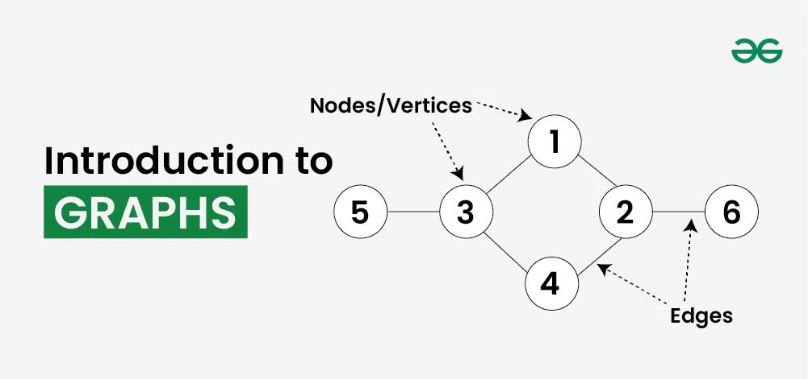
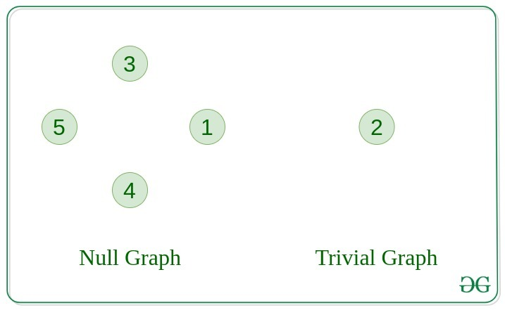
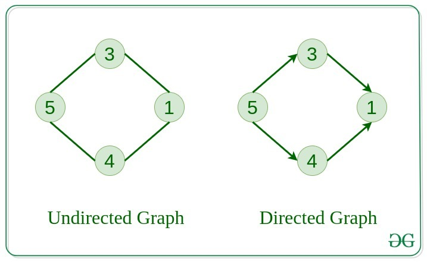
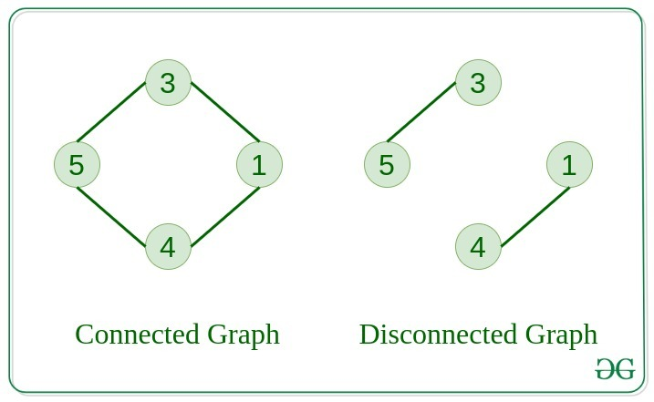
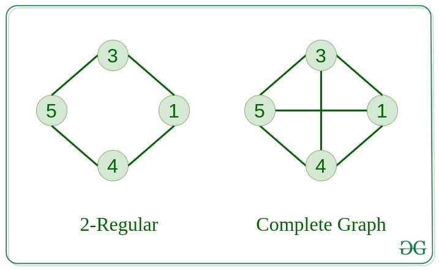
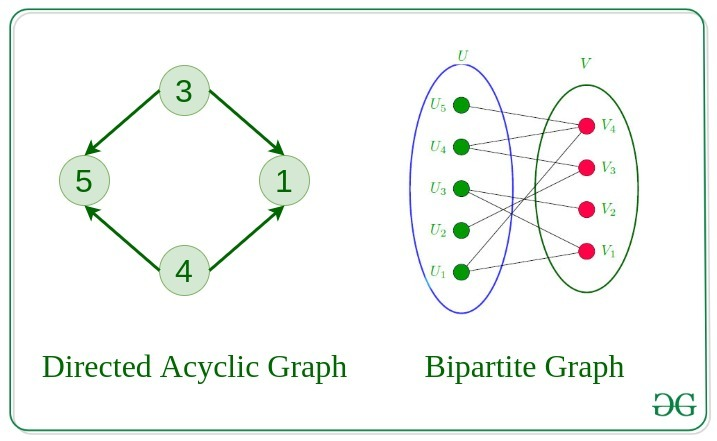
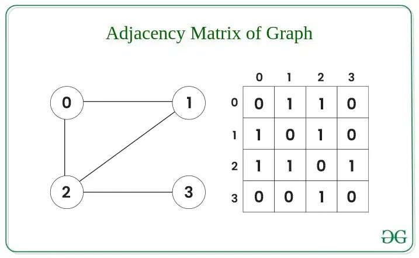
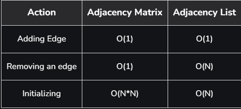

# Graphs in Python

## What is Graph Data Structure?
Graph is a non-linear data structure consisting of vertices and edges. The vertices are sometimes also referred to as nodes and the edges are lines or arcs that connect any two nodes in the graph. More formally a Graph is composed of a set of vertices( V ) and a set of edges( E ). The graph is denoted by G(V, E).

Imagine a game of football as a web of connections, where players are the nodes and their interactions on the field are the edges. This web of connections is exactly what a graph data structure represents, and it’s the key to unlocking insights into team performance and player dynamics in sports.

## Components of Graph Data Structure
- **Vertices**: Vertices are the fundamental units of the graph. Sometimes, vertices are also known as vertex or nodes. Every node/vertex can be labeled or unlabelled.

- **Edges**: Edges are drawn or used to connect two nodes of the graph. It can be ordered pair of nodes in a directed graph. Edges can connect any two nodes in any possible way. There are no rules. Sometimes, edges are also known as arcs. Every edge can be labelled/unlabelled.

## Types Of Graphs in Data Structure and Algorithms
- **Null Graph**
    - A graph is known as a null graph if there are no edges in the graph.
- **Trivial Graph**
    - Graph having only a single vertex, it is also the smallest graph possible.

- Undirected Graph
    - A graph in which edges do not have any direction. That is the nodes are unordered pairs in the definition of every edge. 

- Directed Graph
    - A graph in which edge has direction. That is the nodes are ordered pairs in the definition of every edge.

- Connected Graph
    - The graph in which from one node we can visit any other node in the graph is known as a connected graph. 

- Disconnected Graph
    - The graph in which at least one node is not reachable from a node is known as a disconnected graph.

- Regular Graph
    - The graph in which the degree of every vertex is equal to K is called K regular graph.

- Complete Graph
    - The graph in which from each node there is an edge to each other node.

- Cycle Graph
    - The graph in which the graph is a cycle in itself, the minimum value of degree of each vertex is 2. 

- Cyclic Graph
    - A graph containing at least one cycle is known as a Cyclic graph.

- Directed Acyclic Graph
    - A Directed Graph that does not contain any cycle. 

- Bipartite Graph
    - A graph in which vertex can be divided into two sets such that vertex in each set does not contain any edge between them.

- Weighted Graph
    - A graph in which the edges are already specified with suitable weight is known as a weighted graph. 
    - Weighted graphs can be further classified as directed weighted graphs and undirected weighted graphs. 

## Representation of Graph Data Structure:
There are multiple ways to store a graph: The following are the most common representations.

1) Adjacency Matrix
2) Adjacency List

### Adjacency Matrix Representation of Graph Data Structure:
In this method, the graph is stored in the form of the 2D matrix where rows and columns denote vertices. Each entry in the matrix represents the weight of the edge between those vertices. 

### Adjacency List Representation of Graph:
This graph is represented as a collection of linked lists. There is an array of pointer which points to the edges connected to that vertex. 

### Comparison between Adjacency Matrix and Adjacency List
When the graph contains a large number of edges then it is good to store it as a matrix because only some entries in the matrix will be empty. An algorithm such as Prim’s and Dijkstra adjacency matrix is used to have less complexity.

