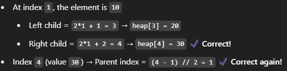
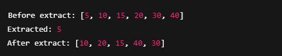

# What Are Heaps? (Intuition First)
## What is a Heap?
- A Heap is a binary tree (but NOT a Binary Search Tree).
- It is a complete binary tree — meaning all levels are completely filled except possibly the last, which is filled from left to right.
- Heaps follow a specific property:
    - **Max Heap**: Every **parent node** is **greater** than or equal to its children.
    - **Min Heap**: Every **parent node** is **less** than or equal to its children.
- So basically:
    - In Max Heap, the largest element is always at the **top** (root).
    - In Min Heap, the smallest element is at the **top** (root).

## STEP 1 — Basic Heap Representation (Array)
- In memory, a Heap is stored as an array, not as a tree. Here's why:
- Example:
    - Given a complete binary tree like this (Min Heap):
    ```markdown
              5
            /   \
          10     15
         /  \   /
        20  30 40
    ```
    The corresponding array is:
    - [5, 10, 15, 20, 30, 40]
- Parent-Child Index Formula:
    - If a node is at index i:
        - Left child → 2 * i + 1
        - Right child → 2 * i + 2
        - Parent → (i - 1) // 2


## TASK 1 for You: Understand Indexing
- Given heap = [5, 10, 15, 20, 30, 40], tell me:
    - What is the left and right child of index 1 (i.e., element 10)?
        - Ans: 
            - Left Index => (2 * 1) + 1 => 2 + 1 => 3 i.e heap[3] => 20
            - Right Index => (2 * 1) + 2 => 2 + 2 => 4 i.e heap[4] => 30
    - What is the parent of index 4 (i.e., element 30)?
        - Ans:
            - Parent of index **i** is given by (i - 1)//2 i.e floor value, so (i - 1)//2 => (4-1)//2 => 3//2 => 1
            - Therefore parent of index 4 is 1




## Now Let’s Design the Heap Class (Step 1 of Implementation)

We’ll follow a clean design using OOP and prepare for both MinHeap and MaxHeap types using inheritance and abstraction.

### STEP 1.1: Base Heap Class (Abstract)
- This will:
    - Use an array internally to store elements.
    - Have abstract comparison logic (min/max heap decides this).
    - Be the parent class for MinHeap and MaxHeap.

```python
from abc import ABC, abstractmethod

class Heap(ABC):
    """ 
    Abstract base class representing a Heap data structure.
    This class provides the foundational utility methods for both MinHeap and MaxHeap.
    It uses an array (list) to represent the complete binary tree.
    """
    def __init__(self):
        """
        Initialize an empty heap using a list.
        """
        self._heap = []
    
    def size(self):
        """
        Returns the number of elements in the heap.
        """
        return len(self._heap)

    def is_empty(self):
        """
        Checks whether the heap is empty.
        """
        return len(self._heap) == 0

    def peek(self):
        """
        Returns the top (min or max) element of the heap without removing it.
        Raises:
            IndexError: if the heap is empty.
        """
        if self.is_empty():
            raise IndexError("Heap is empty")
        return self._heap[0]
    
    # ------- Internal Utility Methods (used by insert and extract) -------
    def _parent(self, index):
        """
        Returns the index of the parent of the given index.
        """
        return (index-1)//2
    
    def _left_child(self, index):
        """
        Returns the index of the left child of the given index.
        """
        return (2 * index) + 1
    
    def _right_child(self, index):
        """
        Returns the index of the right child of the given index.
        """
        return (2 * index) + 2
    
    def _has_left(self, index):
        """
        Checks if the current index has a left child.
        """
        return self.left_child(index) < self.size()
    
    def _has_left(self, index):
        """
        Checks if the current index has a right child.
        """
        return self.right_child(index) < self.size()
    
    def _swap(self, i, j):
        """
        Swaps elements at indices i and j in the heap array.
        """
        self._heap[i], self._heap[j] = self._heap[j], self._heap[i]
    
    # ------- Abstract Methods (must be implemented by subclasses) -------

    @abstractmethod
    def insert(self, val):
        """
        Inserts a value into the heap and maintains the heap property.
        Must be implemented by subclasses.
        """
        pass

    @abstractmethod
    def extract(self):
        """
        Removes and returns the top element of the heap (min or max).
        Must be implemented by subclasses.
        """
        pass

    @abstractmethod
    def _heapify_up(self, index):
        """
        Heapify upwards from the given index (used during insert).
        Must be implemented by subclasses.
        """
        pass

    @abstractmethod
    def _heapify_down(self, index):
        """
        Heapify downwards from the given index (used during extract).
        Must be implemented by subclasses.
        """
        pass
```

## Step 2: Implementing MinHeap class extending Heap Base class
- We’ll start by understanding intuituitions for insert (heapify_up) and extract (heapify_down) and then implementing the following:
    - **insert(value)** → Adds an element while maintaining MinHeap property
    - **_heapify_up(index)** → Helper that "bubbles up" the element to the correct position
    - **extract** → Removes minimum element while maintaining MinHeap property
    - **_heapify_down(index)** → Helper that "bubbles down" the element to the correct position

### Step 2.1: Understanding heapify_up Method in Heaps
- We’ll use a MinHeap (smallest element on top):
    - Let’s insert elements one by one into the MinHeap:
        - Start with an empty heap:
            - [ ]
        - Insert 40:
            - Add it to the end.
            - No parent to compare, so we’re done.
            - Updated Heap: [40]
        - Insert 20
            - Insert at the end → [40, 20]
            - 20 is at index 1
            - Parent index = (1 - 1) // 2 = 0 → heap[0] = 40
            - 20 < 40 → swap
            - Updated Heap: [20, 40]
        - Insert 30:
            - Add to end → [20, 40, 30]
            - Compare with parent (index 1 = 40):
            - 30 < 40 → ❌ but 30 > 20 → ✅ → no swap needed
            - Updated Heap: [20, 40, 30]
        - Insert 10:
            - Insert at end → [20, 40, 30, 10]
            - 10 is at index 3
            - Parent index = (3 - 1) // 2 = 1 → heap[1] = 40
            - 10 < 40 → swap: [20, 10, 30, 40]
            - New index = 1, new parent = (1 - 1) // 2 = 0 → heap[0] = 20
            - 10 < 20 → swap: [10, 20, 30, 40]
            - Updated Heap: [10, 20, 30, 40]

### Summary: What is heapify_up()?
- Used during insert
- You add to the end of the list
- Then you "bubble up" the element by comparing with parent and swapping until heap property is valid

### Step 2.2: MinHeap Class extended with Heap Base class and implemented Insert and _heapify_up method
```python
class MinHeap(Heap):
    """
    Concrete implementation of a MinHeap using the base Heap class.
    Ensures the smallest element is always at the top.
    """

    def insert(self, value):
        """
        Inserts a value into the MinHeap and maintains the heap property.
        """
        self._heap.append(value)  # Add to the end
        self._heapify_up(self.size() - 1)  # Restore MinHeap property

    def _heapify_up(self, index):
        """
        Restores the MinHeap property by bubbling the element at `index` up.
        """
        while index > 0:
            parent_index = self._parent(index)
            if self._heap[index] < self._heap[parent_index]:
                self._swap(index, parent_index)
                index = parent_index
            else:
                break
```

#### Let’s Test the Insert Method!
Here’s a quick test you can run in the same file:

```python
if __name__ == "__main__":
    min_heap = MinHeap()
    min_heap.insert(40)
    min_heap.insert(20)
    min_heap.insert(30)
    min_heap.insert(10)

    print(min_heap._heap)  # Output should be [10, 20, 30, 40]
```

### Step 2.3 Let's Build Intuition for extract() with a Visual
We'll walk through extract() for a MinHeap, which removes the smallest element (the root) and restores the heap property.

- Initial Heap (Array):
    - [5, 10, 15, 20, 30, 40]
    - This corresponds to the following binary tree:

        ```
                5
              /   \
            10     15
           /  \    /
          20  30  40
        ```
- Step 1: Remove the root (minimum element = 5)
    - We always remove the root in a heap because:
        - It’s the min in a MinHeap
        - The only element that breaks the heap structure when removed
    - So, we:
        - Save 5 to return later
        - Replace it with the last element, which is 40
        - Remove 40 from the end
        - New array: [40, 10, 15, 20, 30]
            
            ```markdown
                        40
                      /    \
                    10      15
                   /  \
                  20   30
            ```
- Step 2: _heapify_down from root (40 at index 0)
    - We now fix the heap property from top to bottom.
    - Current: 40
        - Left child: 10 (index 1)
        - Right child: 15 (index 2)
        - ✅ Smallest child = 10
        - → Swap 40 with 10
        - New array: [10, 40, 15, 20, 30]
        - New tree:

            ```markdown
                      10
                    /    \
                  40      15
                 /  \
                20   30
            ```
- Step 3: Continue _heapify_down with 40 at index 1
    - Current: 40
    - Left child: 20 (index 3)
    - Right child: 30 (index 4)
    - ✅ Smallest child = 20
    - → Swap 40 with 20
    - New array: [10, 20, 15, 40, 30]
    - New Tree:
        
        ```markdown
                10
              /    \
            20      15
           /  \
         40   30
        ```
- Step 4: 40 at index 3 → no more children (index 7 and 8 are out of bounds)
    - ✅ We’re done!
    - Final Result:
        - Extracted value: 5
        - Heap after extract:
            - [10, 20, 15, 40, 30]

#### Summary of Logic:
- Save root to return it later
- Replace root with the last element
- Pop the last element
- _heapify_down from root:
    - Compare current with children
    - Swap with the smaller child if MinHeap is violated
    - Repeat until fixed


### Step 2.4: Implementing the extract and _heapify_down methods
- We’ll add two methods to the MinHeap class:
    - **extract()** — removes and returns the minimum value (the root)
    - **_heapify_down(index)** — restores the heap property top-down

#### Add to MinHeap class
```python
from heap import Heap

class MinHeap(Heap):
    """
    This class implements a MinHeap, which is a complete binary tree where the value of each node is less than or equal to the values of its children.
    It inherits from the Heap class.
    Ensures the smallest element is always at the top.
    """
    def __init__(self):
        """
        Initialize an empty MinHeap using a list.
        """
        super().__init__()
    
    def insert(self, value):
        """
        Inserts a value into the MinHeap and maintains the heap property.
        """
        self._heap.append(value)  # Add to the end
        self._heapify_up(self.size() - 1)  # Restore MinHeap property

    def _heapify_up(self, index):
        """
        Restores the MinHeap property by bubbling the element at `index` up.
        """
        while index > 0:
            parent_index = self._parent(index)
            if self._heap[index] < self._heap[parent_index]:
                self._swap(index, parent_index)
                index = parent_index
            else:
                break
 
    def extract(self):
        """
        Removes and returns the minimum element from the MinHeap.
        Maintains the MinHeap property after removal.
        """
        # Check if heap is empty
        if self.is_empty():
            raise IndexError("Cannot extract from an empty heap.")
        
        # Element to return
        min_value = self._heap[0]
        
        # Move the last element to the root and shrink the heap
        popped = self._heap.pop()
        if not self.is_empty():
            self._heap[0] = popped
            self._heapify_down(0)
        
        # Return the minimum value from heap
        return min_value
    
    def _heapify_down(self, index):
        """
        Restores the MinHeap property by bubbling down the element at `index`.
        """
        size = self.size()
        while self._left_child(index) < size:
            # Get left and right index
            left_index = self._left_child(index)
            right_index = self._right_child(index)
            
            # Find the smaller of the two children
            smallest_index = left_index
            if right_index < size and self._heap[right_index] < self._heap[left_index]:
                smallest_index = right_index
            
            # Swap if current is greater than the smallest child
            if self._heap[index] > self._heap[smallest_index]:
                self._swap(index, smallest_index)
                index = smallest_index
            else:
                break

if __name__ == "__main__":
    min_heap = MinHeap()
    for value in [50, 10, 15, 20, 30, 40]:
        min_heap.insert(value)

    print("Before extract:", min_heap._heap)
    print("Extracted:", min_heap.extract())
    print("After extract:", min_heap._heap)
```
#### Output:



